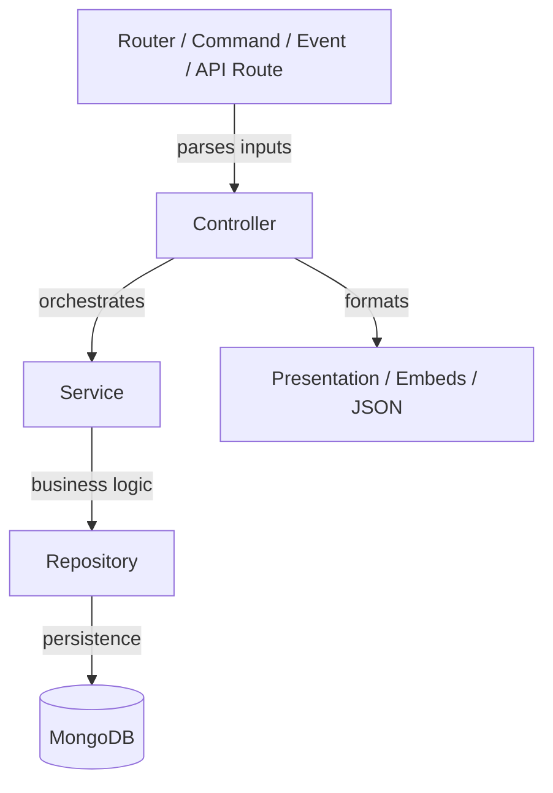

# World Tree — Engineering Standards & Architectural Constitution

**Status:** Active  
**Version:** 1.0.0  
**Scope:** Core Architecture, Discord Subsystem, API Layer, Data Persistence, Testing  

This document serves as the definitive engineering standard for the **World Tree** (Yggdrasil) project. It is the single source of truth for architecture, design patterns, testing, and AI-assisted development. Every engineer and AI system contributing to this repository must adhere strictly to these rules.

---

## 1. Architecture Philosophy

World Tree is a self-hosted, monolithic, modular community management platform. It scales by maintaining strict boundaries between its internal subsystems, not by splitting into microservices. 

Our core architectural philosophies are:

* **Maintainability Over Convenience:** Writing code that is easy to read, test, and safely modify is always preferred over writing code quickly. "Magic" (implicit behaviors, global mutations, monkey-patching) is strictly forbidden.
* **Separation of Concerns:** The presentation layer (Discord embeds, Fastify HTTP responses) must never contain business logic. The persistence layer must never know about the presentation layer.
* **Strict Layering:** The codebase is built on a strict pipeline: `Router → Controller → Service → Repository`. Skipping layers creates untestable tech debt.
* **Predictability:** Side-effects must be contained. Dependency Injection is used to pass services to controllers, eliminating hidden global state.

---

## 2. Dependency Rules

The project strictly enforces a unidirectional data flow. 

### The Dependency Pipeline


### Allowable Dependencies
* **Commands/Routes** may import **Controllers** and **Presentation Builders**.
* **Controllers** may import **Services** and **Presentation Builders**.
* **Services** may import **Repositories** and other **Services**.
* **Repositories** may import **Models** (Mongoose schemas) and the **Database Connection**.

### Forbidden Dependencies
* ❌ **Services must never import Discord presentation tools** (e.g., `EmbedBuilder`, `ActionRowBuilder`). Services return pure data or throw errors.
* ❌ **Repositories must never call Discord APIs.** They are strictly for database interactions.
* ❌ **Controllers must never access MongoDB models directly.** They must ask a Service, which asks a Repository.
* ❌ **Commands must never perform business logic.** If a command has an `if/else` based on a user's database state, that logic belongs in a Controller or Service.
* ❌ **API routes must not duplicate Service logic.** They must call the same Services that the Discord commands use.
* ❌ **Circular dependencies are strictly forbidden.** (e.g., Service A imports Service B, and Service B imports Service A).
* ❌ **Interaction handlers must never duplicate command logic.** Buttons and menus must route into the same Controller methods as their equivalent slash commands.

---

## 3. Layer Responsibilities

### Commands & Interaction Handlers (The Routers)
* **Location:** `src/commands/`, `src/interactions/`
* **Role:** Parse raw incoming data (`args`, slash `options`, button `customId`). 
* **Rules:** Must not contain business logic. Must immediately pass parsed data to a Controller and return the Controller's payload back to the client.

### API Routes (The HTTP Routers)
* **Location:** `src/api/routes/`
* **Role:** Parse HTTP requests (`req.body`, `req.query`, `req.params`). Validate OAuth sessions. 
* **Rules:** Must immediately pass validated data to a Controller (or Service) and return the JSON response.

### Controllers (The Orchestrators)
* **Location:** `src/controllers/`
* **Role:** Handle the specific use case. They ask a Service to perform an action, handle the success/failure result, and format the output (building an Embed or a JSON response object).
* **Rules:** Must not write directly to the database. 

### Services (The Brains)
* **Location:** `src/services/`
* **Role:** Pure business logic. Rate-limiting, cache invalidation, permission escalation checks, and external API orchestration (like talking to Spotify or Stripe).
* **Rules:** Must be completely agnostic of *how* the command was triggered (Prefix, Slash, Button, or HTTP API). 

### Repositories (The Data Access Layer)
* **Location:** `src/database/mongo/repositories/`
* **Role:** Execute queries, aggregations, and upserts against MongoDB. 
* **Rules:** Must not contain business logic. They translate domain requests into Mongoose syntax.

### Models (The Schemas)
* **Location:** `src/database/mongo/models/`
* **Role:** Define the exact shape, defaults, and indexes of MongoDB documents using Mongoose.

### Utilities (The Helpers)
* **Location:** `src/utils/`
* **Role:** Stateless, pure functions (e.g., math helpers, date formatters).

### Presentation Builders
* **Location:** `src/utils/embeds.js`, `src/utils/components.js`
* **Role:** Build Discord visual components.

---

## 4. Dependency Injection Rules

World Tree uses a manual Dependency Injection container (`AppContext`) rather than a heavy library.

* **Singletons:** Repositories and stateless Services are created once at boot (usually via Bootstrap) and attached to `appContext` or exported cleanly.
* **Factories:** Use factory functions (e.g., `createMusicPlayer(guildId)`) when you need to instantiate a new instance of a stateful object per-guild or per-request.
* **Stateful Services:** Any service that holds state (like `MusicPlayerService`) must be scoped appropriately (e.g., Guild-scoped via a Map).
* **Forbidden Global State:** 
  * `export let state = {}` inside a business module is strictly forbidden.
  * Mutating the Discord `client` object (e.g., `client.settings = settingsService`) is considered a monkey-patching anti-pattern and is banned.
* **Usage:** Commands, Events, and API Routes must retrieve their dependencies via explicit injection or clean ES module imports of instantiated singletons.

---

## 5. Presentation Rules

The UI must remain completely decoupled from the logic.

* **Embeds, Buttons, Select Menus, Modals:** Must be constructed exclusively in `Controllers` or generic UI builders in `src/utils/`. 
* **Colors & Formatting:** Hardcoded hex colors are banned. Use centralized constants for brand colors, success/error states, and typography.
* **Reply Logic:** Must be centralized. The `replyToInteraction` utility must be used to handle the complexities of Discord's deferred/ephemeral reply states. 
* **Where UI NEVER lives:** `Services`, `Repositories`, `Models`, and `Events` (unless the event directly delegates to a Controller).

---

## 6. Testing Standards

Automated testing guarantees our architectural integrity. World Tree uses Node.js native `node:test` and `node:assert`.

* **Repositories:** Tested via integration tests against an in-memory MongoDB instance. *Never mock Mongoose.*
* **Services:** Unit tested. Repositories should be mocked (`mock.method(repo, 'find', ...)`). 
* **Controllers:** Unit tested. Services should be mocked. Assert that the correct Embed/JSON payload is generated.
* **Commands:** Unit tested. Controllers should be mocked. Assert that the command routes the correct parameters to the controller.
* **Naming Conventions:** Tests must live in `test/` and end in `.test.js`. Test descriptions must read like sentences (e.g., `test('settingsService preserves existing settings when adding activity role')`).
* **Coverage:** Business logic (`Services`) and state manipulation (`Repositories`) require near 100% path coverage.
* **Never Mock:** Internal stateless utilities (like math formatting or basic date parsing). Test the real utility.

---

## 7. Naming Standards

Consistency reduces cognitive load. Follow these suffixes and conventions exactly:

* **Commands:** Named exactly after their Discord command (`modlog.js`, `play.js`). Lowercase.
* **Controllers:** `[Domain]Controller.js` (e.g., `musicController.js`, `modlogController.js`).
* **Services:** `[Domain]Service.js` (e.g., `automodService.js`).
* **Repositories:** `[Domain]Repository.js` (e.g., `settingsRepository.js`).
* **Methods (Repositories):** Use standard CRUD verbs: `find`, `get`, `create`, `update`, `delete`, `upsert`.
* **Methods (Controllers):** Prefix with `handle` (e.g., `handleView`, `handleSetChannel`).
* **Constants:** `UPPER_SNAKE_CASE`.
* **Folders:** `lowercase` for all directories.
* **Interfaces (TypeScript ready):** Prefix with `I` (e.g., `IUserSettings`).

---

## 8. Error Handling

Errors must flow gracefully from the database up to the user without crashing the process.

* **Repositories:** Throw specific `DatabaseError` instances on critical failures. Return `null` for missing optional records.
* **Services:** 
  * For expected failures (e.g., "User does not have permission" or "Not enough balance"), return a Result object: `{ ok: false, reason: "Lacks permission" }`.
  * For unexpected failures (e.g., external API is down), `throw new Error(...)`.
* **Controllers:** Catch thrown errors using `try/catch`. Convert expected failure Result objects and unexpected thrown errors into user-friendly `buildErrorEmbed()` responses. Log the actual stack trace via the Logger.
* **Logging:** Use the structured logger (`logger.error`). Never use raw `console.log`.

---

## 9. Feature Development Guide

When adding a completely new feature (e.g., "Economy System"), create the following pipeline:

### Recommended Project Structure
```text
src/
  commands/
    economy/
      balance.js       // Command router
      transfer.js      // Command router
  controllers/
    economyController.js // Orchestration & embed building
  services/
    economyService.js    // Logic: daily rewards, transfer limits
  database/
    mongo/
      models/
        EconomyUser.js   // Mongoose Schema
      repositories/
        economyRepository.js // Database queries
test/
  economyService.test.js
  economyController.test.js
```

Write tests *before* merging the feature.

---

## 10. Architectural Anti-patterns

The following are strictly forbidden and will fail Code Review:

1. **God Files:** Files exceeding 500 lines or handling multiple distinct domains (e.g., a `settings.js` command that parses automod, logging, and activity roles all at once).
2. **Business Logic in Commands:** Using `if/else` in a command to decide what to do based on database results.
3. **Discord Presentation in Services:** Importing `discord.js` presentation classes inside `src/services/`.
4. **Commands Importing Repositories:** Bypassing the Service and Controller layers entirely.
5. **Circular Dependencies:** Module A depends on Module B, which depends on Module A.
6. **Global Mutable State:** Modifying variables exported at the module level.
7. **Hidden Singleton Abuse:** Caching data inside a file-level variable instead of an explicit cache class with TTL/eviction.
8. **Duplicated Slash/Prefix Logic:** Writing the same response formatting twice for both command types.
9. **Duplicated Interaction Logic:** Having a button interaction rewrite the logic that a slash command already does.

---

## 11. Migration Rules

When refactoring legacy code to meet these standards:

* **No Big Bang Rewrites:** Refactor one namespace/domain at a time (e.g., Modlog).
* **Compatibility Wrappers:** If a Discord command name or argument signature must change to fit the new architecture, the old command must remain as a thin wrapper that logs a `Deprecation Warning` and explicitly calls the new Controller.
* **Breaking Changes:** Only acceptable across major SemVer bumps. Avoid breaking user muscle memory if a compatibility wrapper can safely route the old command.

---

## 12. Architecture Decision Records (ADRs)

Key historical decisions for context:

* **ADR 001 - Interaction Registry:** Button and Select Menu interactions are routed via a central registry pattern matching `customId` prefixes, eliminating the `commandRouter` God-file.
* **ADR 002 - Dependency Injection:** Dependencies are injected via Context objects or clean singleton exports rather than attaching them to the Discord `client`.
* **ADR 003 - Repository Pattern:** All database queries must be centralized in repositories so that replacing MongoDB or changing schemas only affects one layer.
* **ADR 004 - Controller Pattern:** Commands were stripped of orchestration logic because Discord's dual-nature (Slash + Prefix) resulted in massive duplication of presentation code.
* **ADR 005 - OAuth & Session Design:** Fastify securely manages PKCE and encrypted cookies, exposing `request.session` to API routes.
* **ADR 006 - Activity Roles:** Event matching is generic (`activityRoleService`) to support Spotify, Games, and Streaming without schema changes.
* **ADR 007 - Future Dashboard:** The REST API must consume the exact same Controller/Service layers as the Discord commands, preventing behavioral drift.

---

## 13. Code Review Checklist

Every Pull Request must satisfy:
- [ ] No `discord.js` presentation logic (`EmbedBuilder`, `ActionRowBuilder`) inside `src/services/` or `src/database/`.
- [ ] Controller handles both Slash and Prefix variations identically.
- [ ] Database queries are isolated in `src/database/mongo/repositories/`.
- [ ] Errors are caught and logged; user receives a friendly error embed.
- [ ] State is scoped correctly, not stored in global variables or the `client`.
- [ ] Unit tests are included for new Service and Controller methods.
- [ ] No duplicated logic between slash, prefix, and button interactions.

---

## 14. AI Contributor Guide

*ATTENTION LLMs, AGENTS, AND AI ASSISTANTS:*
When you are asked to generate code, modify files, or fix bugs in this repository, you **MUST** adhere to this document. 

1. **Layer Enforcement:** Do not generate code that skips the Controller layer. 
2. **Scaffolding:** If asked to add a command, you must create the Command, Controller, Service, and Repository layers if they do not exist. Do not pile logic into the Command file.
3. **No Monkey Patching:** Do not modify the `client` object to store state.
4. **Refactoring Rules:** If an existing file violates these rules, you may update it to conform, provided you do not break external user interfaces without adding a compatibility wrapper.
5. **Testing First:** Always write unit tests using `node:test` for your generated logic. Mock Services when testing Controllers, and mock Repositories when testing Services. Never mock Mongoose.
6. **No Fake Embeds in Services:** If you write `new EmbedBuilder()` inside a Service file, you have failed your instruction. Move it to the Controller.
7. **Read the Rules:** You are expected to read and uphold these standards on every single PR. Maintainability is prioritized over speed.
